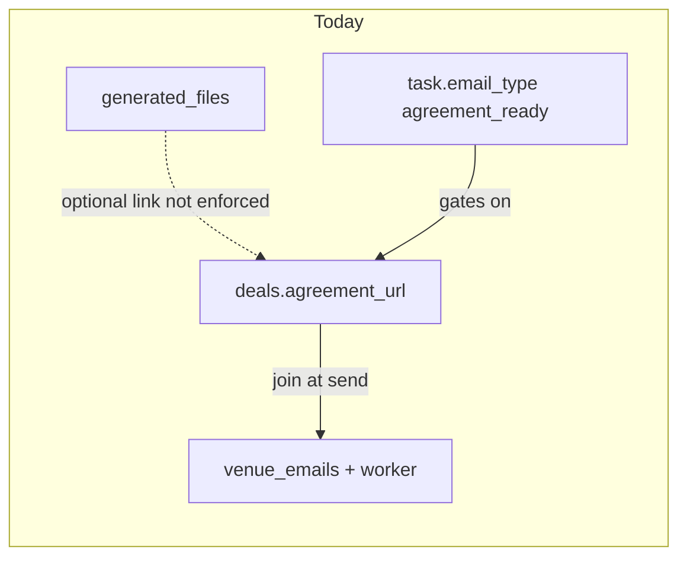
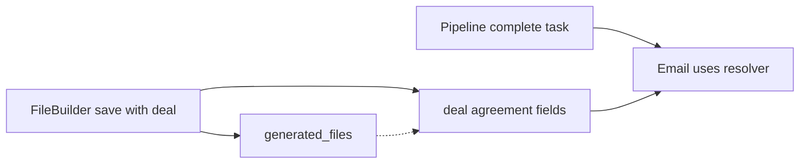

## Diagnostics (2026-04-06)

YAML `todos` above are **`completed` only where each row in this matrix is PASS.** This pass re-checked the repo (no reliance on prior chat or plan YAML). Source spec for checks: Cursor plan `verified_plan_file_copy_56306078.plan.md` (methodology-only; this repo file holds the evidence matrix).

**27 vs 20:** The narrative document has **20** YAML todos plus **7** bullets under [Rollout order](#rollout-order) (sequencing, not seven extra features).

| Todo id | Result | Evidence (repo root: `ARTIST MANAGER WEBSITE`) |
| -------- | ------ | ----------------------------------------------- |
| `migration-schema` | PASS | `supabase/migrations/018_link_tasks_deals_generated_files.sql`: FKs on `tasks`, `task_template_items`, `deals` → `generated_files` with `on delete set null`; indexes created. |
| `design-precedence` | PASS | `src/lib/resolveAgreementUrl.ts` L1–11: precedence order matches product rule. |
| `doc-edit-lifecycle` | PASS | `src/hooks/useFiles.ts` L115–116: documents **new row per save**; repoint deal elsewhere. |
| `post-send-retention` | PASS | `netlify/functions/process-email-queue.ts`: no `.delete()`; `generated_files` only read for resolve (e.g. L259); send updates `venue_emails` only. |
| `ux-linking-moments` | PASS | `src/pages/FileBuilder.tsx`: default-on `setAsDealAgreement` + `updateDeal` on PDF save; `src/pages/Files.tsx`: canonical deal apply from preview; `src/components/pipeline/AgreementPdfPicker.tsx`: “Overrides the deal’s default…”. |
| `venue-emails-worker` | PASS | `process-email-queue.ts` L256–271: `resolveDealAgreementUrlForEmailPayload` + `isGeneratedFileInScopeForDeal`; client `queueEmailOnTaskComplete.ts` / `queueEmailsFromTemplate.ts`: `deals.update` when syncing agreement. |
| `resolver-module` | PASS | `resolveAgreementUrl.ts`: PDF validation, scope helpers, `resolvedPdfHrefFromOrigin`; manual test-vector block L14–27. |
| `queue-task-complete` | PASS | `queueEmailOnTaskComplete.ts`: `computeResolvedAgreement`; `agreement_ready_needs_url` L248; `deals.update` L257; custom venue branches use merged deal. |
| `queue-from-template` | PASS | `queueEmailsFromTemplate.ts`: `computeResolvedAgreement` L78; `deals.update` L91; skip when `agreement_ready` and no URL L95. |
| `use-tasks-recurrence` | PASS | `src/hooks/useTasks.ts` L144–145: spawned task copies `email_type` and `generated_file_id`. |
| `use-tasks-crud` | PASS | `useTasks.ts`: `addTask`/`updateTask`/`select` with `agreement_file` join; `Pipeline.tsx` / `Tasks.tsx`: `AgreementPdfPicker` + form `generated_file_id`; `Tasks.tsx` L289–291 shows linked PDF on row. |
| `use-task-templates` | PASS | `src/hooks/useTaskTemplates.ts`: template item CRUD + `applyTemplate` insert includes `generated_file_id`. |
| `ts-types-db` | PASS | `src/types/index.ts`: `Task`, `TaskTemplateItem`, `Deal` fields; `src/types/database.ts`: matching columns; `Record<>` only for venue/artist labels (no new union requiring `AnyEmailType` map). |
| `ui-pipeline-templates` | PASS | `src/pages/PipelineTemplates.tsx`: `AgreementPdfPicker` + amber warning when doc + non-agreement email type. |
| `ui-pipeline-tasks` | PASS | Shared `AgreementPdfPicker` in dialogs; optional row hint: **Tasks** list shows `agreement_file` name; Pipeline `TaskItem` board row omits PDF subtitle (optional). |
| `ui-file-builder` | PASS | `FileBuilder.tsx`: checkbox default on, `updateDeal` with `agreement_url` + `agreement_generated_file_id` when saving PDF. |
| `ui-files-optional` | PASS | `Files.tsx`: table + preview canonical badges; post-save deal apply; `taskLinksByFileId` / `taskLinkSummary` for pipeline task links (refetch on `preview?.id`). |
| `ui-earnings-deal` | PASS | `Earnings.tsx`: `agreement_generated_file_id` picker + URL derived from selected PDF on save. |
| `send-modal-preview` | PASS | `SendVenueEmailModal.tsx` + `EmailQueue.tsx`: `resolveDealAgreementUrlForEmailPayload` for preview alignment. |
| `verify-tsc` | PASS | Command run 2026-04-06: `npx tsc -p tsconfig.app.json --noEmit` → **exit 0**. |

**Canonical plan copy:** authoritative historical Cursor file remains `c:\Users\brand\.cursor\plans\link_files_to_pipeline_emails_15a5a0ab.plan.md`; **this file** is the repo-local, evidence-backed mirror (`docs/plans/…`).

# Link generated documents to deals, tasks, and agreement emails

## Current state (from codebase)

- `**[generated_files](d:/Main Assets/Brands/Brand Powr/ARTIST MANAGER WEBSITE/supabase/migrations/010_agreement_pdf_files.sql)**` — Stores PDF metadata, `venue_id`, `deal_id`, `pdf_share_slug`, public/share URLs via [`useFiles` / `addPdfFile`](d:/Main Assets/Brands/Brand Powr/ARTIST MANAGER WEBSITE/src/hooks/useFiles.ts). [FileBuilder](d:/Main Assets/Brands/Brand Powr/ARTIST MANAGER WEBSITE/src/pages/FileBuilder.tsx) already lets you pick venue + deal when saving.
- `**[deals.agreement_url](d:/Main Assets/Brands/Brand Powr/ARTIST MANAGER WEBSITE/src/types/index.ts)**` — Single string used by agreement-ready rendering (`[renderVenueEmail.ts](d:/Main Assets/Brands/Brand Powr/ARTIST MANAGER WEBSITE/src/lib/email/renderVenueEmail.ts)`, `[SendVenueEmailModal](d:/Main Assets/Brands/Brand Powr/ARTIST MANAGER WEBSITE/src/components/emails/SendVenueEmailModal.tsx)`, queue worker).
- `**venue_emails**` — Rows reference `deal_id`; `[process-email-queue](d:/Main Assets/Brands/Brand Powr/ARTIST MANAGER WEBSITE/netlify/functions/process-email-queue.ts)` **re-fetches** the deal at send time and passes `deal.agreement_url` into the sender. There is **no `task_id` or `generated_file_id`** on `venue_emails` today—so a pending email **cannot** learn the correct link from the task alone unless the deal row (or request body) already carries the final URL.
- **Tasks** — `[Task](d:/Main Assets/Brands/Brand Powr/ARTIST MANAGER WEBSITE/src/types/index.ts)` + `[task_template_items](d:/Main Assets/Brands/Brand Powr/ARTIST MANAGER WEBSITE/supabase/migrations/006_task_templates.sql)` have `email_type` but **no** `generated_file_id`. `[queueEmailOnTaskComplete](d:/Main Assets/Brands/Brand Powr/ARTIST MANAGER WEBSITE/src/lib/queueEmailOnTaskComplete.ts)` gates `agreement_ready` on `deal.agreement_url` or progress-panel URL.

So today, a PDF can be saved **for** a deal without updating `agreement_url`, and the **buffered queue worker will never see** `task.generated_file_id` unless you persist the resolved link somewhere the worker already reads (typically `**deals.agreement_url`**) or extend `**venue_emails`**.

## Target behavior

**Resolved agreement URL** at queue/send/preview time, with explicit **precedence order** (must be one product rule, documented in code):

Suggested default (adjust in `design-precedence` todo):

1. `options.agreementUrl` from **Venue progress panel** (explicit human paste—highest intent for that flow).
2. `**task.generated_file_id`** → validated `generated_files` row → share URL.
3. `**deal.agreement_generated_file_id`** → file row → URL (if column added).
4. `**deal.agreement_url**` string (external Doc, legacy).

After resolving, either **write back** `deals.agreement_url` (and optionally `agreement_generated_file_id`) when queuing so **existing worker** stays correct, **or** add `**venue_emails.generated_file_id`** and teach **process-email-queue** + **send-venue-email** to resolve—**do not** mix half of each.

Custom venue templates: merge context should receive `**deal.agreement_url` set to the resolved string** so `[customEmailMerge](d:/Main Assets/Brands/Brand Powr/ARTIST MANAGER WEBSITE/src/lib/email/customEmailMerge.ts)` stays dumb and consistent.

## Product: when to link, and multiple valid paths

There is **not** only one moment to connect a document to a deal—your flows should support **both** without forcing a second linking step at pipeline time.

### Path A — At creation (primary, “end of process”)

- [FileBuilder](d:/Main Assets/Brands/Brand Powr/ARTIST MANAGER WEBSITE/src/pages/FileBuilder.tsx) already requires choosing **venue** and can choose **deal** before saving the PDF.
- On **Save PDF**, treat that as the natural time to **finalize the relationship**: write `generated_files.deal_id` / `venue_id` (already), and **also** set the deal’s canonical agreement fields (`agreement_url` + optional `agreement_generated_file_id`) when the user expects this PDF to be what the venue signs—ideally via a **default-on** control (“This is the agreement for this deal”) so most users finish in one session without coming back.
- Interpretation: “before creating” in your wording is covered by **selecting the deal as part of creation**; the **link is established at save**, not only in a separate admin step.

### Path B — Post-create (correction or forgot to check)

- From a **Files** (or equivalent) list: action **“Set as agreement for this deal”** / pick deal, for PDFs saved without turning on the canonical flag.
- Keeps parity with “I can link after creating the document” without re-uploading.

### Pipeline / task completion (automatic send)

- **Goal**: When you complete the **agreement_ready** (or custom) task, the email layer **already knows** which document to use because the **deal** (and only if needed, the task) points at it—**no return trip** to “connect document” again.
- **Canonical source order (product)**:
  1. Deal-level agreement (`agreement_generated_file_id` + derived or synced `agreement_url`) — sufficient for most venues with one active agreement doc.
  2. `**task.generated_file_id`** (and template seed) — **override** when the same venue/deal needs a *different* document for a specific step (edge case); resolver precedence must match `design-precedence`.

### Lifecycle: edits before send; retention after send

- **Before** the send task is completed, the user may **regenerate or replace** the PDF. Implementation must pick one: **update the existing `generated_files` row** (replace storage object, keep slug stable if possible) **or** insert a new row and **point the deal** at the new file id. Either way, **pending** automation should resolve the **current** deal fields at queue/send time.
- **After** send: the file stays in **Files / dashboard**; sending email must **not** delete or archive `generated_files` (today it does not—avoid new `ON DELETE` / soft-delete tied to send).

## Schema changes (Supabase migration)

| Change                                                                                                   | Purpose                                                              |
| -------------------------------------------------------------------------------------------------------- | -------------------------------------------------------------------- |
| `tasks.generated_file_id uuid null references generated_files(id) on delete set null`                    | Task-bound document for agreement / custom flows.                    |
| `task_template_items.generated_file_id uuid null references generated_files(id) on delete set null`      | Copied when template spawns tasks.                                   |
| Optional `deals.agreement_generated_file_id uuid null references generated_files(id) on delete set null` | Deal default file when URL string empty.                             |
| **Optional** `venue_emails.generated_file_id` …                                                          | Only if you choose worker-resolver path instead of syncing deal URL. |

**Integrity (app layer):** Same `user_id` as task owner; `generated_files.venue_id` null or equals `task.venue_id`; `generated_files.deal_id` null or equals `task.deal_id` when task has `deal_id`. **Reject** `output_format !== 'pdf'` or missing share URL/slug for “sendable” agreement links.

## Application logic (files to touch)

1. `**resolveAgreementUrl`** — Pure-ish helper + shared **buildShareUrlFromFile(file, siteOrigin)** to avoid drift with `[useFiles](d:/Main Assets/Brands/Brand Powr/ARTIST MANAGER WEBSITE/src/hooks/useFiles.ts)`. Netlify may need a duplicate tiny helper or env `URL` for origin—note in implementation.
2. `**[queueEmailOnTaskComplete](d:/Main Assets/Brands/Brand Powr/ARTIST MANAGER WEBSITE/src/lib/queueEmailOnTaskComplete.ts)`** — Resolver for `agreement_ready` and **custom venue** template sends that include `deal` merge. Apply **precedence** including `agreementUrl` option.
3. `**[queueEmailsFromTemplate](d:/Main Assets/Brands/Brand Powr/ARTIST MANAGER WEBSITE/src/lib/queueEmailsFromTemplate.ts)`** — Any `agreement_ready` immediate queue must attach correct deal fields (same resolver if task context exists).
4. `**[useTasks](d:/Main Assets/Brands/Brand Powr/ARTIST MANAGER WEBSITE/src/hooks/useTasks.ts)`** — Recurring spawn insert currently copies `email_type` **only**; must also copy `**generated_file_id`**. Extend `addTask` / `updateTask` input types and inserts.
5. `**useTaskTemplates` + apply paths** — CRUD for template items and **bulk task insert** when template runs: include `generated_file_id`.
6. **Types** — `[Task](d:/Main Assets/Brands/Brand Powr/ARTIST MANAGER WEBSITE/src/types/index.ts)`, `TaskTemplateItem`, `Deal`, `[database.ts](d:/Main Assets/Brands/Brand Powr/ARTIST MANAGER WEBSITE/src/types/database.ts)`. Grep `**Record<`** if any email union type changes.

## UI

| Surface                                                                                                                                                                                                                       | Notes                                                                                                                                                                                                                                                                  |
| ----------------------------------------------------------------------------------------------------------------------------------------------------------------------------------------------------------------------------- | ---------------------------------------------------------------------------------------------------------------------------------------------------------------------------------------------------------------------------------------------------------------------- |
| [PipelineTemplates](d:/Main Assets/Brands/Brand Powr/ARTIST MANAGER WEBSITE/src/pages/PipelineTemplates.tsx)                                                                                                                  | Document `Select`: load user’s **PDF** `generated_files`; filter by deal/venue **or** show all with labels (name, venue, deal) to avoid wrong attachment; **empty state** → link to File Builder.                                                                      |
| [Pipeline](d:/Main Assets/Brands/Brand Powr/ARTIST MANAGER WEBSITE/src/pages/Pipeline.tsx) / [Tasks](d:/Main Assets/Brands/Brand Powr/ARTIST MANAGER WEBSITE/src/pages/Tasks.tsx)                                             | Extend existing task dialogs with same picker + optional subtitle “Linked: {file name}”.                                                                                                                                                                               |
| [FileBuilder](d:/Main Assets/Brands/Brand Powr/ARTIST MANAGER WEBSITE/src/pages/FileBuilder.tsx)                                                                                                                              | When `deal_id` set: **default-on** “This is the agreement for this deal” (or equivalent) → sync deal `agreement_url` + `agreement_generated_file_id`; allow opt-out if PDF is reference-only. Short helper copy: deals with this on won’t need re-linking at pipeline. |
| Files / dashboard list                                                                                                                                                                                                        | **Post-save** action: attach PDF to deal as canonical agreement (same write as FileBuilder).                                                                                                                                                                           |
| [Earnings](d:/Main Assets/Brands/Brand Powr/ARTIST MANAGER WEBSITE/src/pages/Earnings.tsx)                                                                                                                                    | Deal editor already has `agreement_url`—decide if picker **replaces** manual URL, supplements, or conflicts; avoid two sources of truth without UI explanation.                                                                                                        |
| [EmailQueue](d:/Main Assets/Brands/Brand Powr/ARTIST MANAGER WEBSITE/src/pages/EmailQueue.tsx) / [SendVenueEmailModal](d:/Main Assets/Brands/Brand Powr/ARTIST MANAGER WEBSITE/src/components/emails/SendVenueEmailModal.tsx) | Preview must use **resolved** URL for agreement types so WYSIWYG.                                                                                                                                                                                                      |

## Gaps and nuances (brainstorm — stones unturned)

### Queue worker / timing

- **Buffered send**: If you only set `task.generated_file_id` and **never** sync to `deal` or `venue_emails`, the cron worker that runs **minutes later** will **not** see the task—only the deal join. This is the **main architectural fork** (sync deal vs extend `venue_emails`).
- **Stale deal**: If user updates `deals.agreement_url` after queueing, the pending email body **changes** at send time (current behavior). Same for resolver if URL is always read fresh from deal.

### Recurrence

- [`useTasks` `completeTask`](d:/Main Assets/Brands/Brand Powr/ARTIST MANAGER WEBSITE/src/hooks/useTasks.ts) spawns the next task with `**email_type` copied** but omits **any future `generated_file_id`**—must copy **or** deliberately clear (product choice: usually **copy** so recurring “send agreement” keeps the same doc).

### Task completion ordering

- `queueEmailAutomationForCompletedTask(task, {})` receives the **in-memory** `task` from the hook—ensure `**generated_file_id`** is on that object after edits/refetch, or fetch fresh task by id before queue (edge case: stale UI).

### File deletion / format

- `ON DELETE SET NULL` on task: agreement_ready task may still fire with **no** URL—fall back to deal or **skip queue** with explicit `reason`.
- **Text-only** `generated_files` rows: not valid for “share link” agreement—validation error at save or resolver returns null.

### Template application without venue

- Template items are **venue-agnostic** until applied to a venue; **file picker** cannot filter by venue until apply time. MVP: show **all PDFs** with deal/venue labels; **strict filter** when task has `venue_id`/`deal_id`.

### Custom email types

- `email_type` of form `custom:<uuid>` for **venue** audience: if blocks reference `deal.agreement_url`, resolver output must feed merge **before** send (`[queueEmailOnTaskComplete](d:/Main Assets/Brands/Brand Powr/ARTIST MANAGER WEBSITE/src/lib/queueEmailOnTaskComplete.ts)` already branches custom vs built-in).

### Security / RLS

- Resolver must only use files **owned by current user**; service role workers must mirror checks if **ever** resolving by id from `venue_emails`.

### TypeScript surface

- Every **task insert** path: grep `from('tasks').insert` and template apply functions.
- `**Partial<Task>`** updates: ensure `generated_file_id` allowed.
- **Optional join** `generated_file:generated_files(...)` on task selects for UI—watch payload size.

### Product / UX edge cases

- **Deal-first mental model**: Train UI copy so users expect **File Builder + deal toggle** to be enough; task-level document is **advanced** (multi-doc / rare).
- **Conflicting sources**: plan says document precedence; UI short note under task picker (“Overrides deal’s agreement for this step only” or similar).
- **Multiple agreement tasks** on same deal: allowed; each task may pin a different `generated_file_id`.
- **Performance**: long PDF lists—**group by venue/deal** or add search (defer if list small).

### Out of scope (unchanged)

- Email **attachments** (binary PDF via Resend).
- Full **version history** UI for agreements on a deal.

## Rollout order

1. Lock **precedence** + **deal-first** copy (`design-precedence`, `ux-linking-moments`).
2. Decide **queue worker strategy** (sync deal vs `venue_emails.generated_file_id`).
3. Migration + TypeScript.
4. Resolver + queue paths + worker/send if needed.
5. `useTasks` recurrence + CRUD + `useTaskTemplates`.
6. UI: **FileBuilder toggle first** (fastest path to “no re-link at pipeline”), Files list actions, then PipelineTemplates / task overrides, Earnings, previews.
7. `**doc-edit-lifecycle`**: re-export behavior before launch if FileBuilder overwrite is in scope.

